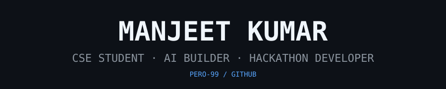

<h3><code>manjeet@github ~ $ whoami</code></h3>

<table>
<tr>
<td valign="top"></td>
<td valign="top"></td>
</tr>
</table>

  

<h3><code>manjeet@github ~ $ ./contributions.sh</code></h3>

  

<h3><code>manjeet@github ~ $ ./links.sh</code></h3>

<b>CSE Student · AI Builder · Hackathon Developer</b>

 
AI · Web · Cloud · Hackathons · Learning in public

