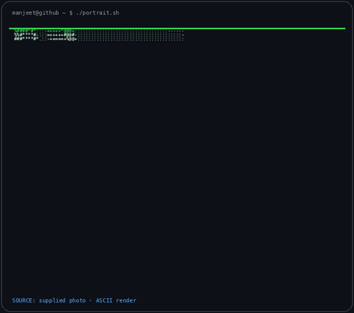
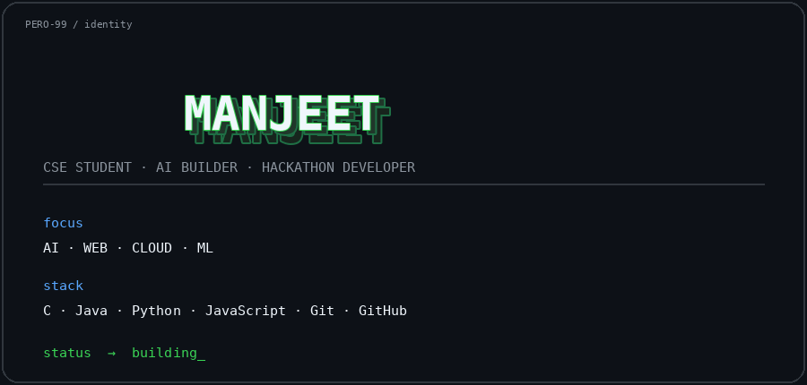
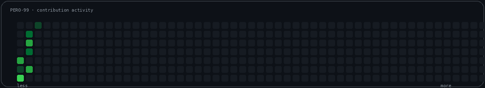

### `manjeet@github ~ $ whoami`

<table>
<tr>
<td valign="top">

</td>
<td valign="top">

</td>
</tr>
</table>

 

### `manjeet@github ~ $ ./contributions.sh`

  

 

🐍 The snake eats my contribution graph · generated automatically every day

  

### `manjeet@github ~ $ ./links.sh`

**CSE Student · AI Builder · Hackathon Developer**

 

AI · Web · Cloud · Hackathons · Learning in public

